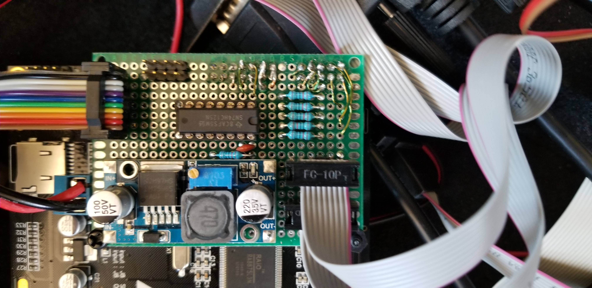
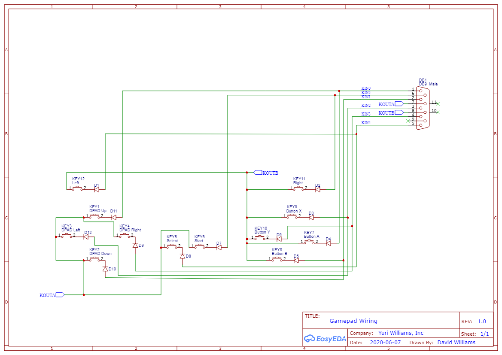
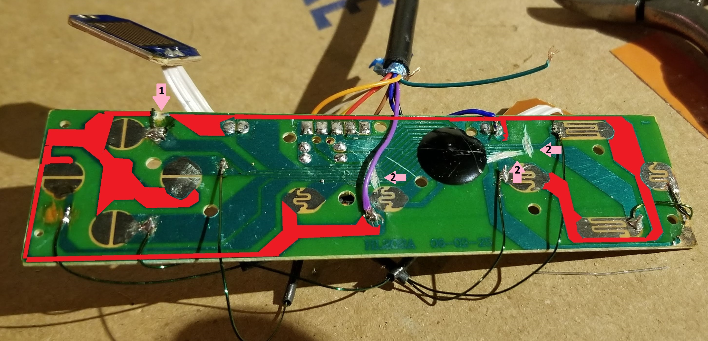
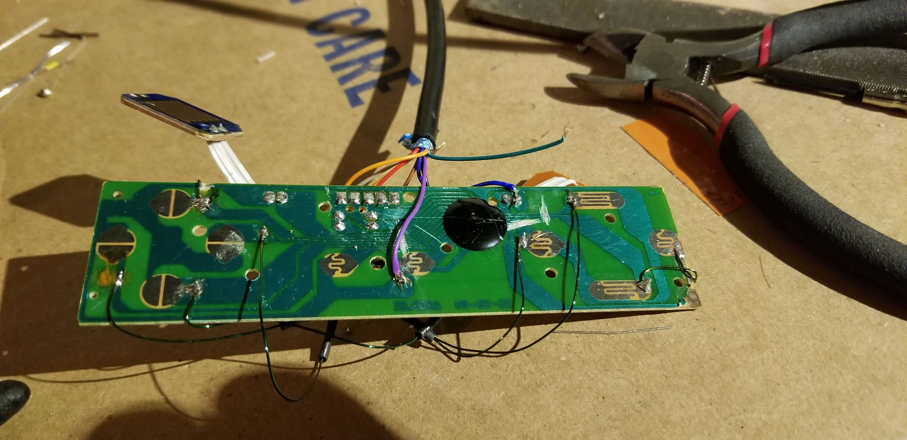

# Altair8800 - LCD Add-on
This project adds LCD support to David Hansel's wonderful Arduino Altair project. I was unsatisfied with needing various add-on boards that talked to my [Altair-duino](https://www.adwaterandstir.com/altair/) over serial and USB to do terminal emulation, Cromemco Dazzler, and joysticks. Unfortunately, pretty much every single pin on the Arduino Due is already used driving the front panel board, which makes doing new things difficult.

However, the board already uses SPI to interface with an SD Card, and I figured that if I freed up another chip select, I could interface an LCD on the same pins. I settled on an 800x480 7" LCD using an RA8875 controller. The RA8875 is great because we get multiple functions on the one device, LCD, resistive touch, and a keyboard matrix.

This will allow terminal emulation, Dazzler support, a touch interface for changing virtual disks, and joystick support. So far, we have Dazzler and joystick support. 

The project uses this great library: https://github.com/sumotoy/RA8875/wiki
The wiki is an outstanding resource on using these displays.

The particular Display I'm using is from BuyDisplay.com and is linked here:
https://www.buydisplay.com/serial-spi-arduino-7-inch-tft-lcd-touch-shield-ra8875-for-mega-due-uno
https://www.buydisplay.com/download/manual/ER-TFTM070-5_Datasheet.pdf
https://www.buydisplay.com/download/ic/RA8875.pdf

Other RA8875, or even other LCD controller chips could be supported.

## Mods to the Altair-duino board
I settled on using the 6 pin header next to the SD Card, as it has the entire SPI interface, and two empty pins that can carry the display's chip select and a GND connection. The existing SD Card software uses HLDA as the chip select, but it is not actually connected to the SD Card. The Altair-duino board grounds it instead. The two jumper wires on the top of the connector bring in HDLA and connects it to the SD CS, and adds MEMR to one of the empty pins to serve as the display chip select. On the other side of the board, we cut a trace to disconnection GND from SD CS.

## Interface board on the display controller.

Unfortunately, we can't simply connect the display directly to the Arduino's SPI bus and 3.3v power. The large LCD draws too much power, so I needed a separate supply of 3.3v. Also the RA8875 does not tristate it's transmit pin when not selected, so I needed a tristate buffer in between. Here is the schematic and the fairly ugly board I built.

The LCD controller has an SD Card slot, and I wired the interface board to use it, but my latest attempts to use it were unsuccessful. The [RA8875 library Wiki](https://github.com/sumotoy/RA8875/wiki/Working-with-a-SD-card-and-troubleshooting) explains why we may not be able to use it. Since the SD Card on slot on the Altair-duino board works just fine, this is not a big deal.

## Dazzler emulation

This is working pretty well. I still think there are improvements to make on performance but it's quite usable as it is.

## Touch support

I started to experiment with using the touch controller. It almost requires use of a separate interrupt pin. You may have noticed a couple of extra jumper wires above, one of them brings the input used for UnProtect to my interface for that purpose. However, performance was in issue in my initial attempts.

## Terminal emulation

This has barely been started.

## Keyboard support

The keyscan interface on the RA8875 is only 4x5, which is not nearly enough for any sort of alphanumeric keyboard. The Due can support a USB keyboard plugged into the native USB port, but that's a pretty valuable resource to use for that. It would be possible to use use one of the existing software serial port pins (or another chip select and the SPI pins) to do a PS2 keyboard interface, but PS2 keyboards are not plentiful. I may end up supporting both of these, or looking for some other type of keyboard.

## Game Controler Support

Since the keyscan interface is not useful for an alphanumeric keyboard, I decided to use it for gamepad support instead. Unfortuanely, the controller's keyscan interface only handles three keys pressed at the same time, and does not support separate make and break codes so we can't tell if a button is held down. However, the keyscan pins can also be used as GPIOs, so we can do the scanning of the matrix ourselves.

The Cromemco joysticks have two analog axes, and four button inputs. I chose to use SNES controllers with a DPAD to emulate the analog joysticks, and the regular A, B, X, Y buttons for the buttons. Using one row output for the DPAD, and one for the buttons, allows support of two controllers using the four row outputs. Since there are 5 column inputs, when I only need 4, I connected the Start, Select, and R/L Shoulder buttons to them.

The DPAD emulation simply returns -127,0, and 126 for the analog values. this works great for many games, but others truly expect and need to get a range of analog values. I may add some sort of time based analog joystick emulation, but it would need to be reconfigurable. I will also want to add sending key inputs when gamepad buttons are pressed, so they can be used with games that are keyboard based.

### GamePad Mods
The original controller is wired to an onboard chip (inside the black blob). It looks something like the diagram below:

A simpler approach is outlined [Here](https://learn.adafruit.com/usb-snes-gamepad/disassemble-the-snes-controller). Since we don't have 12 separate inputs, we have to use a slightly different circuit. Splitting the buttons into two groups and adding diodes so that we can have n-buttons pressed at the same time.

Schematic of modded controller.

We make four cuts. The arrow labeled "1" splits the GND trace so the the buttons are split into two groups, which will will connect to two of the matrix outputs on the RA8875. The cuts labeled "2" disconnect the buttons from the on board controller chip. This may not be necessary as the chip is not powered. 

Then we wire each of the inputs to two diodes which are then connected to the individual buttons.
Splitting the buttons into two rows in the matrix.

Wiring the button contacts to a DB-9 cable. 

The DB-9 pinout chosen is compatible with a standard Atari joystick, although without the diodes, we could only support one, and the software would have to be changed to map KOUT0/KIN4 to the button port. These modded controllers should NOT be plugged into computers that have Atari joystick ports, however as the rest of the pinout is not compatible.

---

Source code for Arduino Altair 8800 simulator 
For details about the simulator see: 
https://www.hackster.io/david-hansel/arduino-altair-8800-simulator-3594a6

Please post any questions or issues in:
https://groups.google.com/forum/#!forum/altair-duino
